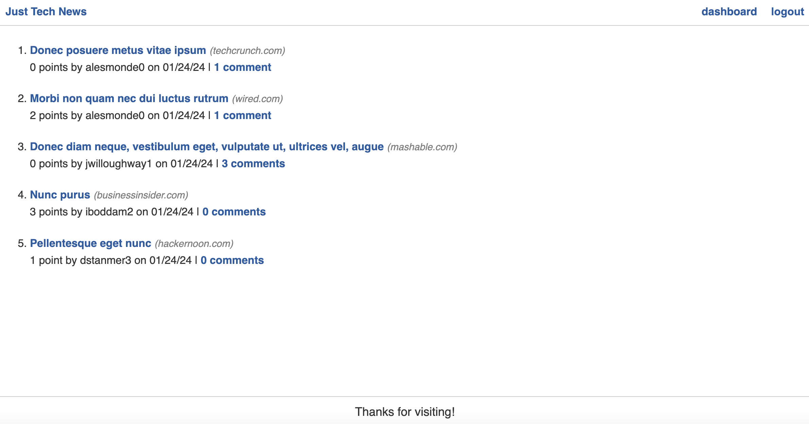

# python-newsfeed

## Description

Just Tech News is a website where users can post, upvote, and comment on links to news articles. Without logging in, users can view posts, comments, and upvotes. After creating an account, users can create their own posts and add comments and upvotes on other people's posts.

## Technology

Technologies used include Python, Flask, MySQL, and SQLAlchemy.
The app is a RESTful API that performs full CRUD operations.

## Usage
Check out Just Tech News [here](https://just-tech-news0124-4d1a2b5b6e3f.herokuapp.com/).

